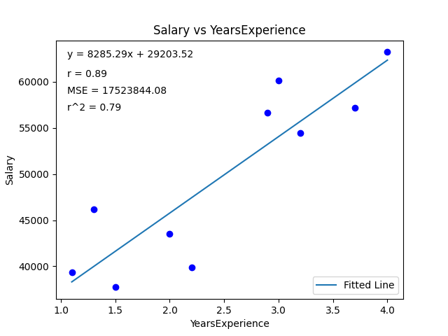
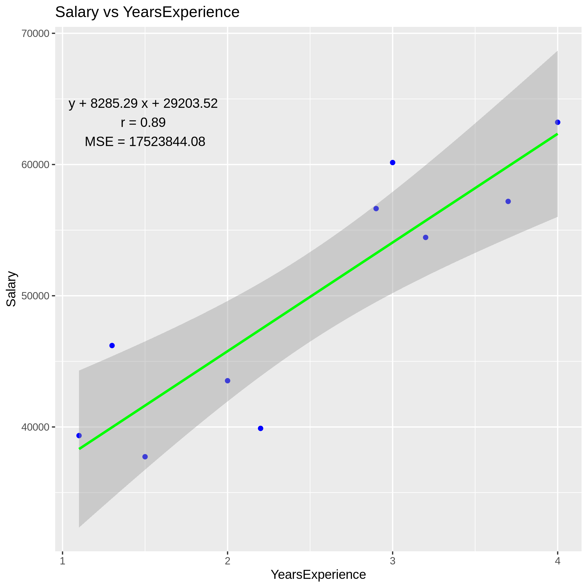

## V1.1 - Assignment 3
This assignment has been updated from assignment 2 to assignment 3. The README will also be updated, with pertinent/leftover code and files staying while I add new ones. 

## Assignment Purpose and Description
This repo features two notebooks, one in Python (Linear_Regression_Py_Notebook) and one in R (Linear_Regression_R_Notebook), that input a specific data set, plots it in a scatter plot, models a linear regression line, and plots the line on the graph. Next, further statistical analyses including Mean Standard Error (MSE), Pearson's correlation coefficient (r), and the r-squared (r2) values were calculated and both placed on the graph and printed in the notebook. I completed this assignment with an older data set before it was updated, so there is some vestigal code that still works from it. In general, the workflow was: input CSV, print CSV, plot graph, make line, plot graph + line, evaluate data. There are also two scripts, one in Python and one in R, that allow the user to input their own CSV file with two columns and plot a scatter plot with linear regression line and statistical analyses. Both scripts also output various evaluative landmarks to better understand the data. The notebooks I wrote were not very compatable with this method, so the scripts look quite different. There are four PNG files in this repo, linear_regression_r_output.png, linear_regression_python_output.png, updated_linear_regression_r_output.png and updated_linear_regression_python.png that show the scatterplot and linear regression line for each script, respectively. I have absolutely no idea how Rplots.pdf made its way into this folder but he isn't causing any harm, so I let him stay. There are also .html versions of the aformentioned notebooks so the code can be read outside of Jupyter Lab.

## Here, I will go further into each file:

## Linear_Regression_Py_Notebook.ipynb
I first import the csv module to read csv files. I open the csv file and give it the variable name "lr_data." I then read the lr_data file and for every row in the file I print it, so I have a table of values. This is an easy way for me to see that the file was properly read by the program. Next, I import various packages. Specifically, I import pandas, matplotlib, and numpy. Using pandas, I read the data for future permutations.For python, I used arrays to read the previous data set before this one. This code still worked, so I kept it. Using numpy, I created an array of the yearsexperience values and an array of the salary values, labeled x_lr, and y_lr, respectively. I printed this array too so I can see that this worked. Next, I created the scatter plot. I used the plt.scatter command, using x_lr and y_lr as my variables, and chose black as my color. I used the plt.title, plt.xlabel, and plt.ylabel to make my labels, and plt.show() to print the graphFor the linear regression, my previous code used the np.polyfit command from numpy. This created a linear line with x_lr as the x variable, y_lr as the y variable, and a linearity of 1. It printed the slope and intercept. I am not sure if these values are 100% accurate but I left it in regardless. I used the same commands that created the scatterplot and assigned the slope and intercept values from the np.polyfit command. I then created a line using the abline_value command, using the slope and intercept defined earlier and an x variable from x_lr. I then plotted it in red. Again, I am not sure this is an accurate linear regression value, so in case it is not, I continued with the class example.I imported the LinearRegression command from sklearn. I created a model of linear regression and fitted it using the YearsExperience and Salary data. I then put this line on a graph, and accidentally input a line with no data points. I kept it to show that the line worked.To round it all out, I created the scatter plot, plotted the line, titled the graph, and ALSO plotted my original linear regression line. It looks like the line was accurate as there was complete overlap. I proceeded to do various statistical analyses. Using Scikit learn I used the mean_squared_error function to calculate and then print the MSE value. Using the previously generated intercept value from the np.polyfit command, I printed and explained the y-intercept. Using the previously generated slope value from the np.polyfit command, I printed and explained the slope of the linear regression line. Using the model.score data function, I calculated, printed, and explained the r2 value. Using scipy, I imported the PearsonR function to calculate the correlation coefficient. I then calculated both the correlation coefficient and the p_value and printed both. I only explained the correlation coefficient. I also performed this using a numpy command. Lastly, I put these statistical analyses on the linear regression graph, but placed the graph further up to better show the evolution of the graph.

## Linear_Regression_R_Notebook.ipynb
Like python, I completed this with older data sets, and then had to redo it. Some of the code still worked. Also like python, I started by reading the CSV file. I created a lr_data variable that is a read of the csv file. I then printed the file, to again show that the correct data was being read. I then used the plot command to plot the YearsExperience and Salary from lr_data, colored it, labeled it, and gave it a fun little data point marker, all using the various modifiers for the plot command. My original linear regression did not jive with the new data, so I rebuilt the linear regression code from the class example. I redid the graph to make sure it works, created a model using the lm command, comparing the Salary and YearsExperience data pulling from lr_data. I added the ggplot2 library, and using ggplot, I created a prediction model from the x and y variables. I am not exactly sure how this code works. I then titled the graphs and axes, and printed a summary. I proceeded to do various statistical analyses. I predicted the model and place it in a variable, using the mse function to calculate the MSE value and then print it. I felt fancy when I wrote it so I played around with an if:then statement after. Using the previously generated model, I took the second value from it, the slope, and I printed and explained the slope. Using the previously generated model, I took the first value from it, the y-intercept, and I printed and explained the y-intercept. Using the cor() function, I calculated the correlation coefficient and explained it. Using the summary of the model, I printed and explained the r-squared value. Lastly, I put these statistical analyses on the linear regression graph, but placed the graph further up to better show the evolution of the graph.

## Linear_Regression_R_Notebook.Rmd
This was the file type directed by the assignment to add the R notebook. This is a very ugly file since the graphs are just paragraphs of text, but just covering my bases.

## linear_regression_python.py
This is mostly from the class example as I could not get my arrays to work with inputting your own data. I REALLY wanted them to work but relented after several attempts of x_lr being undefined when it looked like it was defined. First, I import several modules. I import sys, pandas, matplotlib, scipy.stats, and numpy. The code that allows the executable script to run with the inputs of file name, x_col (renamed x_var), and y_col (renamed y_var) are written. Like the notebook, I have pandas read the file, import CSV module, open it as lr_data, read lr_data, and for every row print the file. Therefore, I know the data I am putting into the script is accurate and the initial code works. There is a party with the plt commands next. First, I place the x_var data and y_var data into separate arrays, as this was the only way to complete one of the statistical analyses that I was able to find. Next, I plt.scatter to plot the scatter plot with the generic x_var and y_var data. Then, I title the plt.title to name the plot y_var vs x_var. I plt.xlabel and plt.ylabel the axes with their headers. Using sklearn, I import the linearregression tool and create a linear regression model. I fit the data to the model, and then plt.plot the model with a separate color. I then calculated the MSE value, r-squared value, and correlation coefficient values and assigned them variable names. I created multiple lines of figure text in the top left of the graph, print the various statistical analyses, and limit them to two decimal places. The exception to this is the correlation coefficient, which used a different method to calculate and was unable to be shortened, so I left it with all of the decimal points. I placed the legend of the graph in the bottom right as I placed the stats in the top left. I save the figure using the plt.savefig command. 

## linear_regression_r.r
This is mostly from the class example as I could not get my original code to work, something with xlim not working when I had no xlim value. I added the usual argument command that allowed the user to type in a csv file, their x column header, and their y column header. I then read and printed the data, which was a good indicator that my initial argument code worked and that the correct data was being read into the code. Similar to python, I created arrays for my x and y data, but could not get them to work in any statistical test. I took three hours to get the python data to work so I did not want to erase this even if no future lines of code pulled from it. The formula and model code is a bit confusing, but similar to the notebook it creates a model of a linear regression reading the data from lr_data. For formula, I am not really sure what that does. I then used ggplot to make the graph in a much more concise way than my initial notebook. I annotated the graph with the various statistical analyses I ran and put them in the top left of the graph. I gave the summary at the end so we still had some metrics for how the analysis went, and used the ggsave command to output the graph as a png.

## updated_linear_regression_plot_python_output.png
Graph output from the python script.

## updated_linear_regression_plot_r.png
Graph output from the r script.

## regression_data.csv
The data used for the exercise. It is a csv with YearsExperience and Salary columns. 

## Rplots.pdf
A pdf of the png file of the R graph. This was generated from the r script.

## Tools Used
For R, I used ggplots2. For Python, I used pandas, matplotlib.pyplot, numpy, scikit, and scipy.